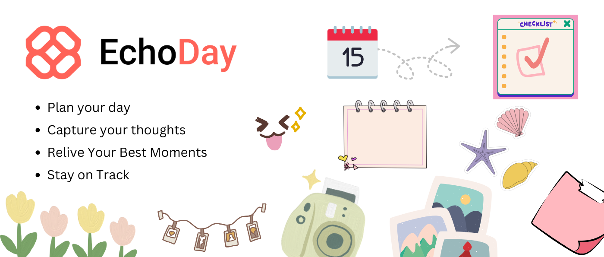

# EchoDay: Capture and reflect on your day



Live App: [EchoDay](https://echoday.netlify.app)

Dev.to Post: [EchoDay Post](https://dev.to/paras594/echoday-capture-and-reflect-on-your-day-3gik)

Built during the [KendoReact Challenge on Dev.to](https://dev.to/challenges/kendoreact)

---

EchoDay is a web app centered around daily reflection, where each day feels like an echo. Whatever you add - notes, memories, or thoughts - comes back to you later, helping you revisit and reflect on moments that matter.

### Features

It features a set of handy widgets - one place to store them all.

- A Calendar to plan your schedule
- Notes for jotting down ideas
- An About My Day section to reflect on your day
- Todos list to stay on top of tasks
- Reminders, so you never miss anything
- Memories, where you store cherished images

Oh, it also has a little mood tracker with some fun emojis and moods to choose from :)

## Technologies

- [KendoReact UI Library](https://www.telerik.com/kendo-react-ui)
- [React + Vite](https://vite.dev/guide/)
- [Zustand + Immer](https://zustand.docs.pmnd.rs/getting-started/introduction)
- [Netlify Hosting](https://www.netlify.com/)
- [FormBricks](https://formbricks.com/)
- [SASS](https://sass-lang.com/)

## Steps to run

**Prerequisites**:

- Node (v22)
- NPM (v11)
- FormBricks Account

**Commands**

```sh
# install dependencies
$ npm install

# run project
$ npm run dev
```

Opens http://localhost:5173/ in your browser
